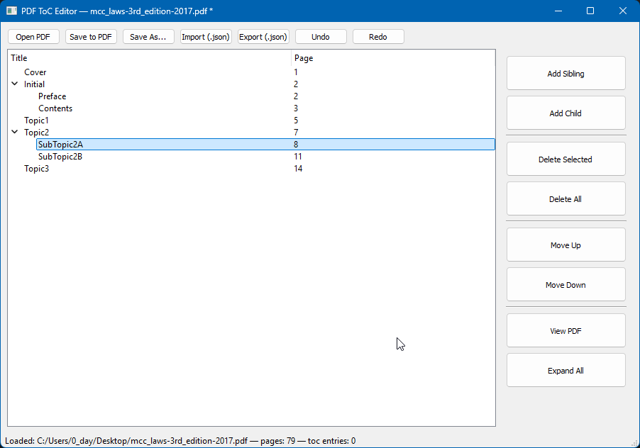

# 📑 PDF ToC Editor

A simple desktop application for editing the **Table of Contents (ToC)** in PDF files.  
Built with [PyQt5](https://pypi.org/project/PyQt5/) for the GUI and [PyMuPDF](https://pymupdf.readthedocs.io/) for PDF handling.



## ✨ Features
- Open any PDF and view its existing ToC.
- **Edit ToC**: add, rename, delete, move, or nest entries.
- **Drag & drop reordering** of ToC entries.
- **Import/Export ToC** in JSON format.
- Save the modified ToC **directly into the PDF**.
- **Keyboard shortcuts** for quick actions
- **View the opened PDF** in your default PDF viewer

### # Example ToC Export (JSON)
   ```json
    [
       [1, "Chapter 1", 1],
       [1, "Chapter 2", 5],
       [2, "Section 2.1", 6],
       [2, "Section 2.2", 10],
       [1, "Chapter 3", 15]
    ]
   ```

## ⌨️ Keyboard Shortcuts
| Keystroke          | Action                 |
|--------------------|------------------------|
| `Ctrl + O`         | Open PDF               |
| `Ctrl + N`         | Add Sibling Entry      |
| `Ctrl + Shift + N` | Add Child Entry        |
| `Ctrl + T`         | Edit Selected Title    |
| `Ctrl + E`         | Edit Selected Page No. |
| `Ctrl + A`         | Select all             |
| `Ctrl + ↑ / ↓`     | Move item(s) up/down   |
| `Delete`           | Delete selected        |
| `Ctrl + Z / Y`     | Undo/Redo              |
| `Ctrl + S`         | Save to PDF            |
| `Ctrl + Shift + S` | Save As...             |

## ⚙️ How It Works
- Uses **PyMuPDF (`fitz`)** to parse and modify PDF ToC entries.
- ToC is represented hierarchically in a **tree view widget** (editable by double-click).
- Supports both **single page references** and **page ranges** (e.g., `5-10`).
- Saves changes **incrementally** (`saveIncr`) to avoid rewriting the whole file.

## 📦 Installation

### Clone Repository
```pwsh
git clone https://github.com/clarkewinshell/pdf-toc-editor.git
cd pdf-toc-editor
```

### Install Dependencies (*optional*)
```pwsh
pip install -r requirements.txt
```

- ### Install as Package (*legacy*)
  -  If you are depending on older method `setup.py` to run the app. This will also install the CLI shortcut pdf-toc-editor.
   ```pwsh
   pip install -e .
   ```

## 📃 Usage

### Run with python
```pwsh
python -m pdf_toc_editor.main
```

### Run with CLI shortcut from installed script
If you installed the package or you have the config file you can run it from anywhere.
```bash
pdf-toc-editor
```

## 🔨 Build Executable

### You can package this app in a single `.exe` using `pyinstaller`

```pwsh
pip install pyinstaller

pyinstaller --onefile --noconsole --windowed --icon assets/icon.ico --strip app/main.py
```

### Or,
 Use the `build.bat` script
 ```pwsh
 start build
 ```

 ### Or,
 Use the `build.spec` file
 ```pwsh
 pyinstaller build.spec
 ```

## ⚠️ Warning
-   Page ranges in ToC (`x-y`) are accepted but only the **start page** is stored in the PDF ToC format.
-   By clicking `Save to PDF` edits are saved directly into the opened PDF (no copy is made).
-   If you want a backup, Click `Save As...` instead.

## 📜 License
### This project is licensed under the [MIT License](LICENSE)

## &copy; Copyright
Icon downloaded from https://www.emoji.co.uk
